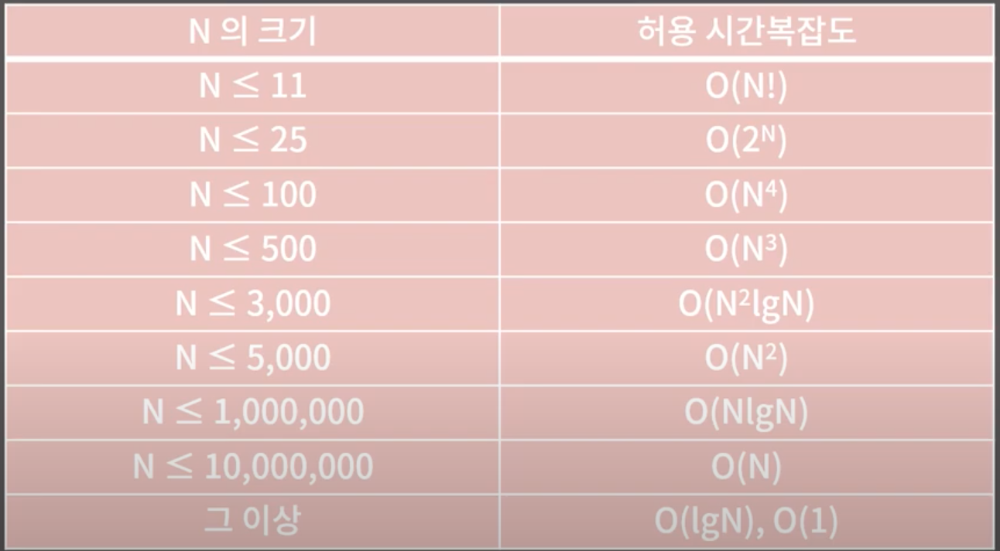

## 시간복잡도

> 문제
> 
> 대회장에 N명의 사람들이 일렬로 서있다. 거기서 당신은 이름이 '가나다'인 사람을 찾기 위해 이름을 물어볼 것이다. 이름을 물어보고 대답을 듣는데까지 1초가 걸린다면 얼마만큼의 시간이 필요할까?
> 
> 정답: 앞에서부터 차례대로 물어보면 된다. 최악의 경우 N초, 최선의 경우 1초, 평균적으로 N/2초가 필요하다. 걸리는 시간은 N에 비례한다.

> 문제
> 
> 대회장에  N명의 사람들이 일렬로 서있다. 거기서 당신은 이름이 '가나다'인 사람을 찾기 위해 이름을 물어볼 것이다. 이 때 사람들은 이름 순으로 서있다. 이름을 물어보고 대답을 듣는데까지 1초가 걸린다면 얼마만큼의 시간이 필요할까?
> 
> 정답: 업다운 게임을 하듯이 중간 사람에게 계속 물어보면 된다. 최선의 경우 1초, 최악의 경우 lg N초, 평균적으로 lg N초가 필요하다. 걸리는 시간은 lg N에 비례한다.

#### 시간 복잡도 (Time Complexity)

- 입력의 크기와 문제를 해결하는데 걸리는 시간의 상관관계

#### 빅오표기법 (Big-O Notation)

- 주어진 식을 값이 가장 큰 대표항만 남겨서 나타내는 방법
- 대소 비교: O(1) < O(lgN) < O(N) < O(NlgN) < O(N^2) < O(2^N) < O(N!)
- O(N): 5N + 3
- O(N^2): N^2 + 2N + 4
- O(NlgN): NlgN + 30N + 10
- O(1): 5

#### 문제의 시간복잡도를 예상하고 해결하자! 

#### 공간 복잡도 (Space Complexity)

- 입력의 크기와 문제를 해결하는데 필요한 공간의 상관관계
- 512MB = 1.2억개의 int
