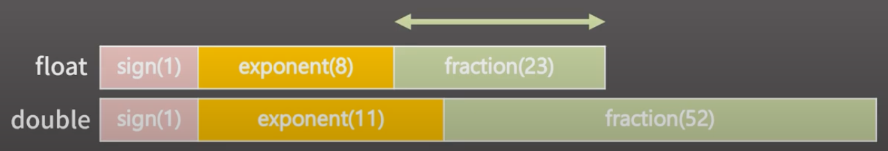

## 자료형

#### 정수 자료형

- char 자료형은 1 byte = 8 bit 이다.
- char(1 byte) = (2^7-1)127
- unsigned char(1 byte) = (2^8-1)255
- short(2 byte) = 2^15-1(32767)
- int(4 byte) = 2^31-1(2.1 x 10^9)
- long long(8 byte) 2^63-1(9.2 x 10^18)

#### 실수 자료형

- float(4 byte): 유효숫자 6자리
- double(8 byte); 유효숫자 15자리

- sign: 부호 / exponent: 지수 / fraction: 유효 숫자
1. 실수의 저장/연산 과정에서 반드시 오차가 발생할 수 밖에 없다.
2. double에 long long 범위의 정수를 함부로 담으면 안 된다.
3. 실수를 비교할 때는 등호를 사용하면 안 된다.