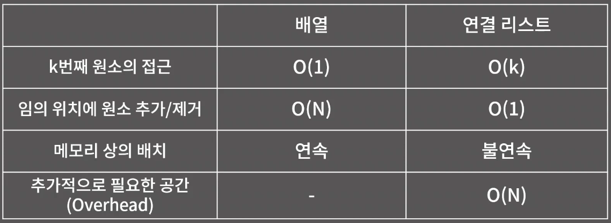

## 연결리스트

- 연결 리스트의 성질
1. k번째 원소를 확인/변경하기 위해 O(k)가 필요함
2. 임의의 위치에 원소를 추가/임의 위치의 원소 제거는 O(1)
3. 원소들이 메모리 상에 연속해있지 않아 Cache hit rate가 낮지만 할당이 다소 쉬움.

- 연결 리스트의 종류
1. 단일 연결 리스트(Singly Linked List)
2. 이중 연결 리스트(Doubly Linked List)
3. 원형 연결 리스트(Circular Linked List)

